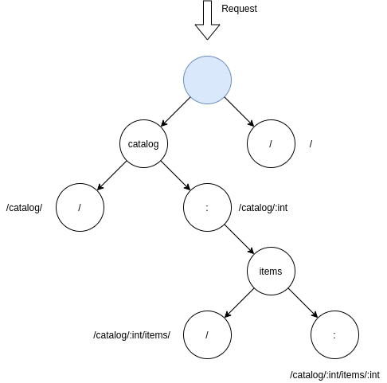

mixer
=====

`mixer` is a simple parametrized router for building HTTP services.

The designed API is a similar to [httprouter.Router](https://godoc.org/github.com/julienschmidt/httprouter#Router)
but allows us to use the typed path params.

Install
-------

```bash
$ go get -u github.com/kxnes/mixer
```

How it works
------------

The `ServeMux` based on the similar [trie](https://en.wikipedia.org/wiki/Trie) data structure.
Let's see at URL examples:

```
/
/catalog/
/catalog/:int
/catalog/:int/items/
/catalog/:int/items/:int
```

The inner tree structure will be like this:



What about API
--------------

Why not
-------

